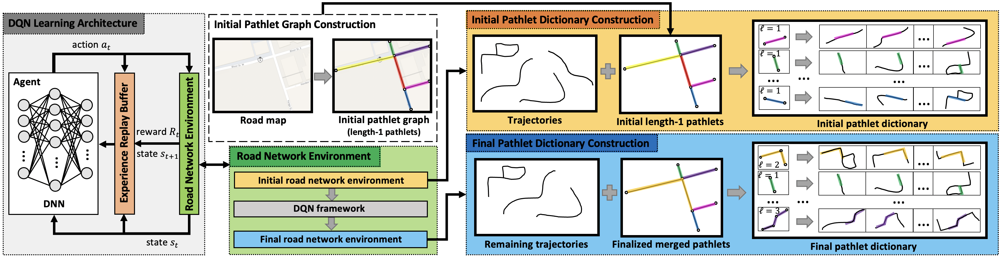
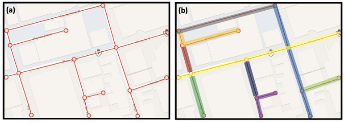

# PathletRL: Trajectory Pathlet Dictionary Construction using Reinforcement Learning
A deep learning model based on reinforcement learning to construct trajectory pathlet dictionaries. This is the Github repository of our paper [PathletRL: Trajectory Pathlet Dictionary Construction using Reinforcement Learning](https://doi.org/10.1145/3589132.3625622), recently accepted at the 2023 Proceedings of the 31st ACM SIGSPATIAL International Conference on Advances in Geographic Information Systems (nominated for Best Paper Award!).

The paper is available in the given DOI link (see at the end of this README), if not accessible, see: https://drive.google.com/drive/folders/1C20g9dzVb_lhyIas2U96nAuqXOZUmZtJ?usp=sharing



## Abstract
Sophisticated location and tracking technologies have led to the generation of vast amounts of [trajectory data](https://doi.org/10.1145/2743025). Of interest is constructing a small set of basic building blocks that can represent a wide range of trajectories, known as a *trajectory pathlet dictionary*. This dictionary can be useful in various tasks and applications, such as [trajectory compression](https://www.cs.albany.edu/~jhh/publications/muckell.gis10.gps.pdf), [travel time estimation](https://dl.acm.org/doi/10.1109/ITSC48978.2021.9564901), [route planning](https://ieeexplore.ieee.org/document/9137965), and [navigation services](https://en.wikipedia.org/wiki/Navigation_system). Existing methods for constructing a pathlet dictionary use a top-down approach, which generates a large set of candidate pathlets and selects the most popular ones to form the dictionary. However, this approach is memory-intensive and leads to redundant storage due to the assumption that pathlets can overlap. To address these limitations, we propose a bottom-up approach for constructing a pathlet dictionary that significantly reduces memory storage needs of baseline methods by multiple orders of magnitude (by up to 24K times better). The key idea is to initialize unit-length pathlets and iteratively merge them, while [maximizing utility](https://link.springer.com/book/10.1007/978-3-540-34183-3). The [utility](https://en.wikipedia.org/wiki/Utility) is defined using newly introduced metrics of *trajectory loss* and *trajectory representability*. A deep reinforcement learning method is proposed, <ins>**PathletRL**</ins>, that uses [Deep Q Networks (DQN)](https://arxiv.org/abs/1312.5602) to approximate the utility function. Experiments show that our method outperforms the current state-of-the-art, both on synthetic and real-world data. Our method can reduce the size of the constructed dictionary by up to 65.8% compared to other methods. It is also shown that only half of the pathlets in the dictionary is needed to reconstruct 85% of the original trajectory data. 

## Pathlets

<p align="center">
  
</p>

**Pathlets** are basically subpaths of the road network. In our setup, we frame pathlets as *edge-disjoint*, which means that no two pathlets are overlapping (in terms of edges). In the example above, (a) represents the graph-based representation of a road network in a small area in Toronto, and (b) are some examples of edge-disjoint pathlets of various lengths.

## Requirements
The code was run in Ubuntu machines, but it can also be run on Macs (based on the packages listed in ```requirements.txt```; for example ```tensorflow-macos``` is specifically for the Mac). In general you can install most of the packages using the following command. 

```
pip install -r requirements.txt
```

It can be noted that this is mostly built with ```Tensorflow``` and specifically ```tf-agents``` specifically for RL models. 

## Datasets
In our experiments, we used the ```Toronto``` dataset, which we provide the link on our [shared Google Drive](https://drive.google.com/drive/folders/1e-9M7oaRs1rjczetsu5Hw-zJ4ye1km1l?usp=sharing) (we could not share it through Github due to size). Moreover, the ```Rome``` dataset that we also used is publicly available and is being hosted on [Crawdad](https://crawdad.org/). In case you want to use your own datasets, here are the specifics for curating and formatting them appropriately. Please ensure first that your datasets have already been [map-matched](https://dl.acm.org/doi/10.1145/1653771.1653820)). Now grab your dataset and preprocess it as follows:

1. Have a ```.json``` file called ```traj_edge_dict.json```. This dictionary should have the following keys and values formatting:

| Keys | Values |
| --- | --- |
| ```1``` | ```[[273, 272], [272, 347], [347, 321], [321, 379], [379, 385], [385, 320]]``` |
| ```6``` | ```[[1362, 1558]]``` |
| ```11``` | ```[[115, 349], [349, 348], [348, 605]]``` |
| ... | ... |

Here, each trajectory (keys are the trajectory IDs) is mapped to a list of edges (road segments) in the road network (i.e., ```[u, v]``` is an edge in the road network where ```u``` and ```v``` are node/road intersection IDs). It is important to note that all trajectories have to be continuous (no gaps), which means that the "end node" of the previous edge is the same as the "start node" of the following edge. Ensure this, otherwise you could run into errors later in the long run.

2. Now also have ```traj_coords_dict.json```, which is literally the same file as above but we replace every road intersection ID with a length-```2``` list the consists of the longitude and latitude coordinates of the node in the road network.

3. Now curate ```traj_pathlets_dict.json``` (i.e., the pathlet-based representation of trajectories) by mapping each edge in ```traj_edge_dict.json``` to a pathlet ID (you can curate a ```pathlet_dict.json``` later that does this. See Step 4). Each ID will be a string. Here is an example.

| Keys | Values |
| --- | --- |
| ```1``` | ```['12267', '12398', '12478', '12479', '12484', '12915']``` |
| ```6``` | ```['60845']``` |
| ```11``` | ```['62672', '12400', '46585']``` |
| ... | ... |

This means that edge ```[273, 272]``` has pathlet ID ```'12267'```. It also means that some edge ```[272, 273]``` maps to the same pathlet ID (under this circumstance where the road network is undirected). Also, you can think of the pathlets as "edges" initially since all pathlets are length-```1```, which are simply just the edges of the road network.

4. Now curate ```pathlet_dict.json```, which you can also do before Step 3. Each key here represents the IDs of the pathlets or edges (the road segments), and then the values are consists of a list of the IDs of the nodes/road intersections. Here is an example:

| Keys | Values |
| --- | --- |
| ```'321'``` | ```[0, 1]``` |
| ```'48612'``` | ```[1364, 0]``` |
| ```'49547'``` | ```[687, 1]``` |
| ... | ... |

5. A ```pathlet_rev_dict.json``` is also necessary, which acts as the "reverse" for each of the pathlet. So for example, the pathlet ```'321'``` would have value ```[1,0]``` for the reversed version.

6. Now also curate ```pathlet_linestring_geocoords_dict.json```, wherein we simply have the same as ```pathlet_dict.json```, except we replace each node ID with its geocoordinates (using format ```[lon, lat]```). Here is an example:

| Keys | Values |
| --- | --- |
| ```'321'``` | ```[[-79.4003885376461, 43.6539374403798], [-79.4004299062703, 43.654050659457]]``` |
| ```'48612'``` | ```[[-79.4001992261045, 43.6534389242195], [-79.4003885376461, 43.6539374403798]]``` |
| ```'49547'``` | ```[[-79.3994261868947, 43.6542490977903], [-79.4004299062703, 43.654050659457]]``` |
| ... | ... |

7. Therefore, we also do the same for its reversed version: ```pathlet_rev_linestring_geocoords_dict.json```.
  
8. Though not necessarily required, it would be good to have the json file ```road_intersections_coordinates.json```. It could potentially be helpful when curating the necessary datasets. It is not required and serves only as for reference. Basically, its keys are IDs of nodes/road intersections and its values are the geocoordinates of such node/road intersection.

## Running the Model

1. Place all the datasets to be used under a directory called ```/data/```

2. There are some parameters that you can modify as you wish in the following file: ```/utils/param_setup.py```. There really is no need to modify it if you wish to leave the parameter values default.

3. Run the PathletRL using the following command:

```
python main_rl.py --dataset --model_name --alpha1 --alpha2 --alpha3 --alpha4 --learning_rate --n_iters --collect_steps_per_iteration --n_episodes --replay_buffer_size --batch_size --rep_buff_dset_steps --rep_buff_dset_prefetch --weighted --representability --psa
```

Please supply each argument with a value. Below lists the arguments and descriptions of each argument:
* ```--dataset```: the name of the dataset (note that if you plan to use your own dataset, you have to go and modify some specific parameters in ```/utils/param_setup.py```; please see the file for the example that needs changing.
* ```--model_name```: the name of the model (the work makes use of DQN and then RND for the ablation experiment)
* ```--alphaX```: there are four ```alpha``` values each associated with the four objective terms, where ```X``` is either ```1```, ```2```, ```3```, or ```4``` (all ```alphaX``` values should sum to 1)
* ```--learning_rate```: the learning rate
* ```--n_iters```: the number of iterations for running the model
* ```--collect_steps_per_iteration```: the number of data collect steps for each iteration
* ```--n_episodes```: the number of episodes for each of the ```n_iters``` iterations
* ```--replay_buffer_size```: the size of the replay buffer
* ```--batch_size```: the batch size
* ```--rep_buff_dset_steps```: the number of steps for the replay buffer for the dataset
* ```--rep_buff_dset_prefetch```: the number of prefetch for the replay buffer for the dataset
* ```--weighted```: if we consider a weighted model?
* ```--representability```: if trajectory representability is considered?
* ```--psa```: if we want to conduct parameter sensitivity analysis? If that's the case, then modify some specific parameters in ```/utils/param_setup.py```; please see the file for the example that needs changing.

## Other Notes
Note that if it cannot find some folder, then you would have to create the directory as required. If it cannot find some file, it might be stored in another directory.


## Citation

If you like our work or if you plan to use it, please cite our work with the following BibTeX format:

```
@INPROCEEDINGS{alix2023pathletrl,
  author={Alix, Gian and Papagelis, Manos},
  booktitle={2023 Proceedings of the 31st ACM SIGSPATIAL International Conference on Advances in Geographic Information Systems}, 
  title={PathletRL: Trajectory Pathlet Dictionary Construction using Reinforcement Learning}, 
  year={2023},
  volume={},
  number={},
  pages={},
  doi={https://doi.org/10.1145/3589132.3625622}
}
```

Or you can also use this ACM citation:

> Gian Alix and Manos Papagelis. 2023. PathletRL: Trajectory Pathlet Dictionary Construction using Reinforcement Learning. In The 31st ACM International Conference on Advances in Geographic Information Systems (SIGSPATIAL ’23), November 13–16, 2023, Hamburg, Germany. ACM, New York, NY,
USA, 12 pages. https://doi.org/10.1145/3589132.3625622

## Contact

Please contact me gcalix@eecs.yorku.ca for any bugs/issues/questions you may have found on our code. Thank you so much.
